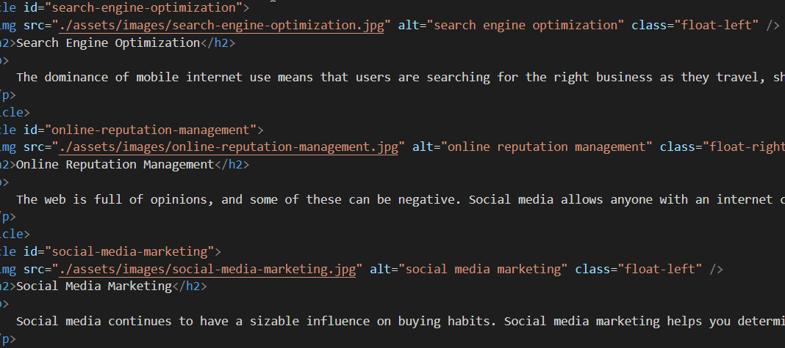

# horiseon-code-refactor

## Description
This project was started to refactor the website to make it more accessible. I noticed this HTML was difficult to read and any future update's or addition's to this webpage would be difficult so in this project I changed the elements of the documents to be symantic and easier to read. I condensed the CSS file to a smaller size and made it easier to read. 

> **Note**: This layout is designed for desktop viewing, so you may notice that some of the elements don't look like the mock-up at a resolution smaller than 768px.

## Process
* HTML
1. Added alt elements to assist with screen readers.
2. The title of the HTML page to a asthetically pleasing title of The company name Horiseon with homepage to let users know which page they are on.
3. The header element to header from the previous div element. As there is only 1 header I deleted the unnecessary class associated with this section.
4. The navigation bar was not identified. So I changed the elements in the HTML file to better identify the navigation bar.
5. The image in the center of the homepage was changed to the proper figure element.
6. The element of the first section of the homepage was changed to section.
7. The elements of the second section of the homepage was changed to aside.
8. Changed the elements in the sections to article as each part of the sections could be used on their own.
9. The footer was not properlly defined. So the element for footer was changed and the unnecessary class associated with footer was deleted.

* CSS
1. The class descriptor for header was deleted so that the css would apply to the header element.
2. Changed the descriptor's for the navigation elements and navigation list.
3. Changed the class discriptor's to elemtents and deleted duplicate entries. 

* Installation
https://christopherponzio.github.io/horiseon-code-refactor/

## Usage
Added alt text to make it more accessible.

## Credits
1. https://stackoverflow.com
2. https://w3schools.com

## License
No License